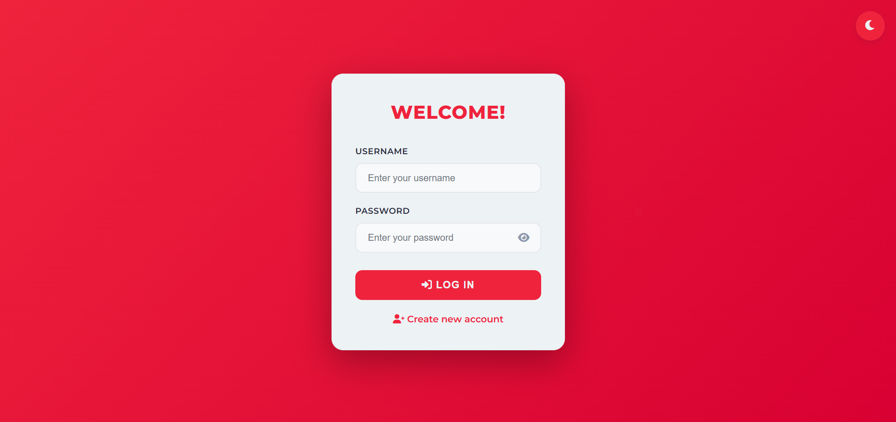
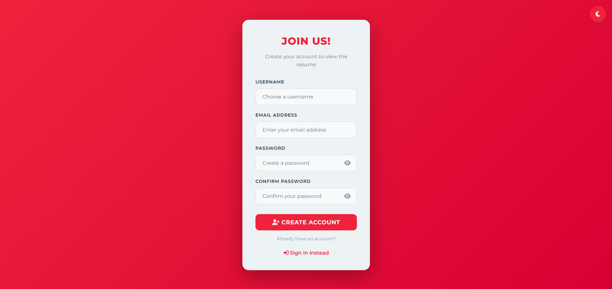

# Donayre-CV

A modern, responsive personal CV/résumé website showcasing professional background, experience, and achievements. Built with a clean design and interactive features including theme switching and PDF download functionality.

## 🌟 Features

- **Responsive Design** - Fully optimized for desktop, tablet, and mobile devices
- **Light/Dark Mode Toggle** - Seamless theme switching with persistent user preferences
- **PDF Download** - One-click CV download in PDF format
- **User Authentication** - Secure login and registration system with form validation
- **Interactive UI** - Smooth animations, hover effects, and engaging user experience
- **Modern Design** - Clean, professional layout with contemporary styling

## 🛠️ Technologies Used

**Frontend:**
- HTML5
- CSS3 (with CSS Variables for theming)
- JavaScript (ES6+)
- Font Awesome Icons
- Google Fonts (Montserrat)

**Backend:**
- PHP 7.4+
- PostgreSQL
- PDO for database interactions

**Key Libraries/Tools:**
- Session Management
- Password Hashing (bcrypt)
- Input Validation & Sanitization

## 📸 Screenshots

### Authentication Pages

**Login Page**


**Sign Up Page**


### Homepage - Light Mode


### Homepage - Dark Mode


## 🚀 Installation & Usage

### Prerequisites

- PHP 7.4 or higher
- PostgreSQL 12 or higher
- Web server (Apache/Nginx) or PHP built-in server

### Setup Instructions

1. **Clone the repository**
   ```bash
   git clone https://github.com/ailadonayre/Donayre-CV.git
   cd Donayre-CV
   ```

2. **Configure the database**
   - Create a PostgreSQL database named `donayre_cv`
   - Update database credentials in `config.php`
   ```php
   $host = "localhost";
   $port = "5432";
   $dbname = "donayre_cv";
   $user = "your_username";
   $password = "your_password";
   ```

3. **Create the users table**
   ```sql
   CREATE TABLE users (
       id SERIAL PRIMARY KEY,
       username VARCHAR(50) UNIQUE NOT NULL,
       email VARCHAR(100) UNIQUE NOT NULL,
       password_hash VARCHAR(255) NOT NULL,
       created_at TIMESTAMP DEFAULT CURRENT_TIMESTAMP,
       last_login TIMESTAMP
   );
   ```

4. **Start the development server**
   ```bash
   php -S localhost:8000
   ```

5. **Access the application**
   - Open your browser and navigate to `http://localhost:8000`
   - Default admin credentials: `admin` / `1234`

## 📋 Features Overview

### Authentication System
- Secure user registration with password hashing
- Login validation with session management
- Form validation on both client and server side
- Flash messages for user feedback

### CV Display
- Personal information section
- Education timeline
- Professional experience with highlights
- Achievements showcase
- Technology stack display

### User Experience
- Persistent dark mode preference using localStorage
- Smooth page transitions and animations
- Keyboard shortcuts support
- Accessibility features (ARIA labels, focus states)
- Success notifications

## 🎨 Color Scheme

**Light Mode:**
- Primary: `#2b2d42`
- Secondary: `#8d99ae`
- Accent: `#ef233c`
- Background: `#edf2f4`

**Dark Mode:**
- Primary: `#1a1c2e`
- Secondary: `#2b2d42`
- Accent: `#ef233c`
- Text: `#edf2f4`

## 📱 Browser Support

- Chrome (latest)
- Firefox (latest)
- Safari (latest)
- Edge (latest)

## 👤 Author

**Aila Roshiele Donayre**
- LinkedIn: [aila-roshiele-donayre](https://www.linkedin.com/in/aila-roshiele-donayre/)
- GitHub: [@ailadonayre](https://github.com/ailadonayre)
- Email: ailaroshieledonayre@gmail.com